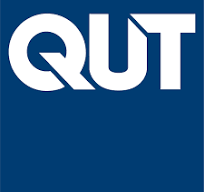
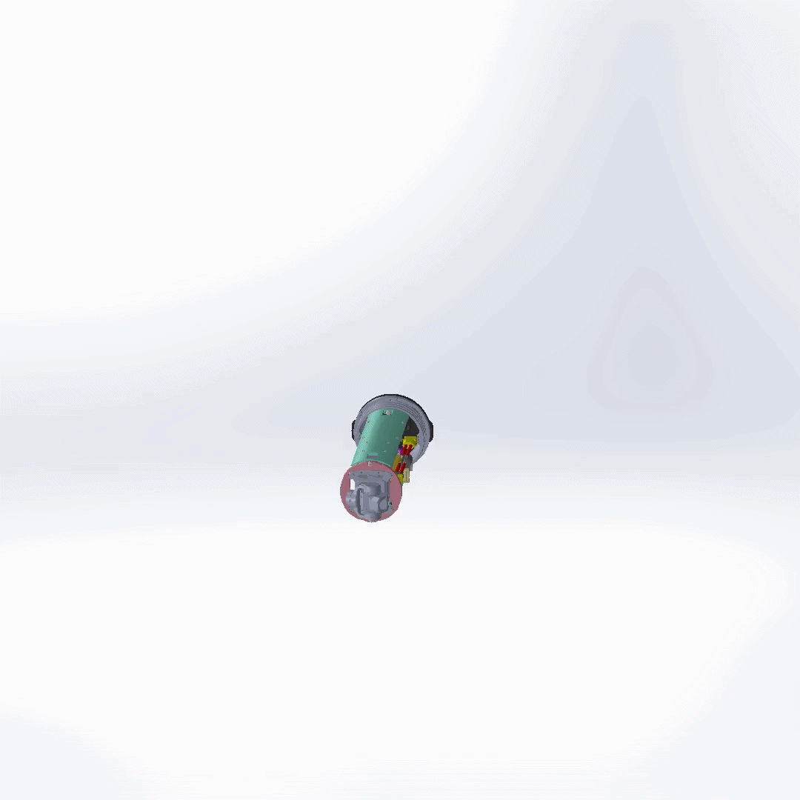
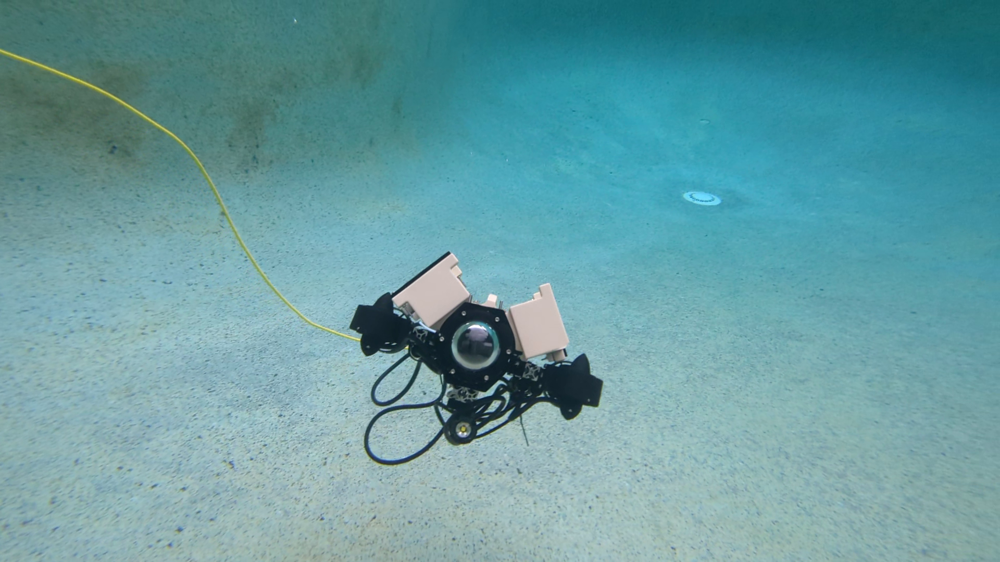
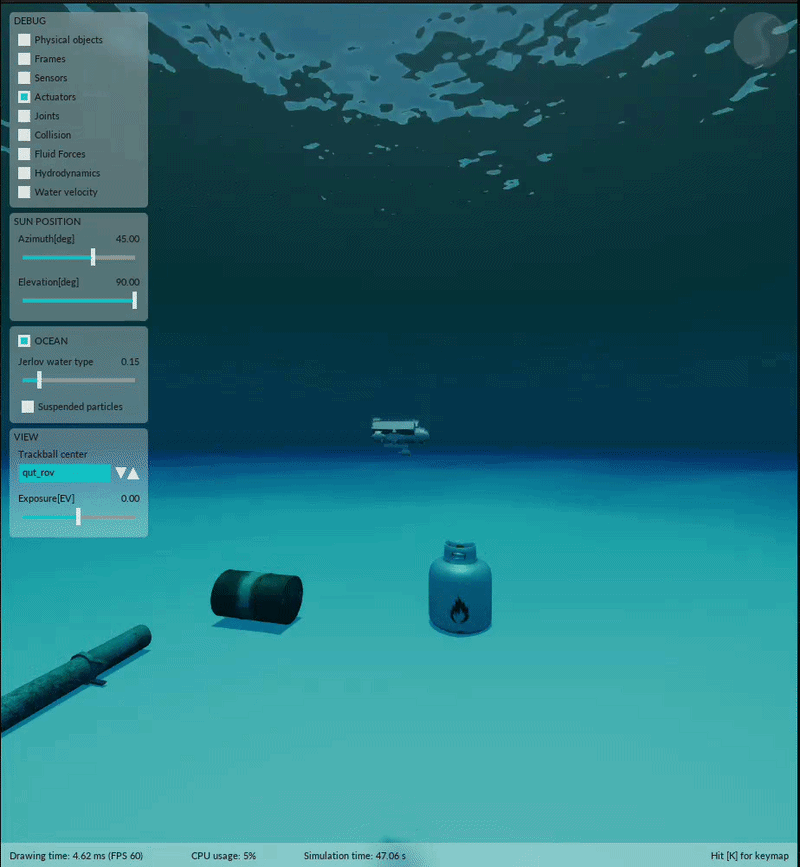
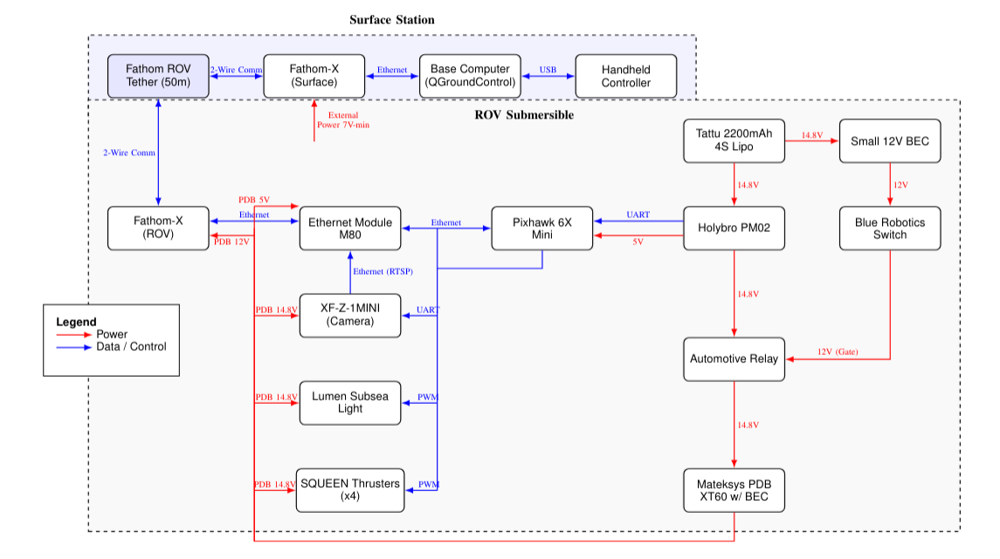
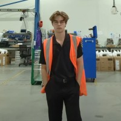
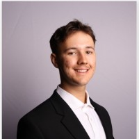
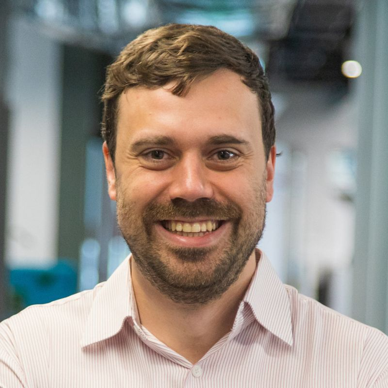

  

  
  
  

# SubbyROV: A Small-Scale Underwater ROV

|  |  |
| :---: | :---: |
| *Final SolidWorks Render* | *WTE Design Render* |
|  |  |
| *Electronics Tray Prototyping* | *Stonefish Simulation Demo* |

## About the SubbyROV Project

This project, part of the EGH400 and EGH490 Research Projects at Queensland University of Technology (QUT), documents the development of a small-scale, research-grade Remotely Operated Vehicle (ROV).

This repository serves as the open-source hub for the project, containing all design specifications, CAD models, software, and simulation files.

### Motivation

While QUT possesses a capable BlueROV2, its large size, complex handling, and setup requirements (e.g., pool approval) make it impractical for rapid prototyping, small-scale tests, or educational demonstrations.

This project aims to fill that gap by creating a highly modular, cost-effective, and compact ROV. The primary objective is to build a fully operational vehicle that can serve as:

1.  A versatile testbed for novel Machine Learning (ML) control pipelines and advanced LQI controllers.
2.  An accessible and portable platform for QUT open days and demonstrations.

### At a Glance & Bill of Materials (BOM)

The SubbyROV is designed from the ground up to be small, agile, and computationally capable, using a mix of Commercial-Off-The-Shelf (COTS) and custom 3D-printed parts. 

| Specification | Details |
| :--- | :--- |
| **Project Name** | SubbyROV  |
| **Structure** | Blue Robotics 3" watertight enclosure on a custom aluminum Item profile frame. |
| **Propulsion** | 4 x APISQUEEN U2 MINI thrusters with external waterproof ESCs. |
| **Configuration** | Experimental 45-45 degree vectored thruster layout. |
| **Main Controller** | Pixhawk 6X flight controller. |
| **Software** | ArduSub firmware communicating via MAVLink protocol. |
| **Camera** | Z-1 Mini gimballed camera. |
| **Communication** | Fathom-X Tether Interface Boards for Ethernet-over-tether. |
| **Power** | Tattu 5200mAh 4S (14.8V) LiPo Battery. |
| **Est. Runtime** | ~32 minutes (at typical cruising draw). |
| **Total Weight** | ~3.2 kg (3,209.29 g) |
| **Total Cost** | $2,884.38 AUD |

*Note: For the full itemized Bill of Materials, refer to Appendix B of the Final Project Report in the `/Documentation` folder.*

## System Design Architecture

  

The SubbyROV operates on a robust, decentralized communication and control architecture designed for maximum reliability and modularity. At its core, the **Pixhawk 6X** flight controller runs the ArduSub firmware, which handles low-level stabilization and thruster mixing for the 4-thruster vectored configuration.

Surface communication is achieved through **Fathom-X** Tether Interface Boards, which provide a high-speed Ethernet connection over a single twisted pair tether. This Ethernet link allows a top-side control station running QGroundControl or a custom ROS2 ground station to send MAVLink commands and receive live HD video streams from the internal IP camera, bypassing the need for heavy, multi-wire tethers.

## Project Status

**Current Status:** The primary hardware development and initial manual testing phases have successfully concluded. The SubbyROV has demonstrated watertight integrity, stable camera streaming, and reliable basic teleoperation during pool testing.

**Future Work:** The project is currently being continued by Brad Edwards. Building upon the solid mechanical and electrical foundation, the next major phase focuses heavily on software and control. Utilizing the digital twin developed in Stonefish, Brad is actively working on:
- Implementing advanced underactuated 4-thruster control laws (such as LQI controllers).
- Developing autonomous navigation and pathing capabilities.
- Integrating computer vision algorithms to transition the ROV from a manually operated prototype to a fully capable autonomous testbed.

## Stonefish Simulation Environment

To accelerate the development of complex underactuated control systems and autonomous behaviors without risking the physical hardware, a custom ROS2 package `stonefish_qut_rov` has been developed. 

Leveraging the **Stonefish** marine simulator, this digital twin accurately models the ROV's hydrodynamics and vectored thruster configuration. 

**Key Simulation Capabilities Include:**
- `teleop.py`: Manual teleoperation and thrust testing.
- `station_keeping_node.py`: Advanced depth and heading holding algorithms.
- `pid_controller.py`: Tuning PID control loops for stable navigation.
- `ball_centering.py`: Computer vision testing for autonomous object tracking using the simulated camera feed.

## Repository Contents

* **/CAD:** All SolidWorks 2025 part files, assembly files, and technical drawings for the final design. These have been converted to STEP files for accessability.
* **/StonefishSimulation:** Custom ROS2 package containing the Stonefish digital twin, launch files, and autonomous Python nodes.
* **/Documentation:** The final project reports, complete Bill of Materials (BOM), additional information, and presentations.
* **/Showcase:** Images, GIFs, and media videos showcasing the prototype build, testing and SolidWorks renders.

## The Team

This capstone project is proudly developed by student engineers at QUT, under the supervision of Tobias Fischer.

<table>
  <tr>
    <td align="center">
      
       
      <b>Joshua Hecke</b>
       
      <i>Lead Mechatronics Engineer</i>
    </td>
    <td align="center">
      
       
      <b>Brad Edwards</b>
       
      <i>Simulation & Control Engineer</i>
    </td>
    <td align="center">
      
       
      <b>Tobias Fischer</b>
       
      <i>Project Lead & Supervisor</i>
    </td>
  </tr>
</table>

**Supervisor GitHub:** [tobias-fischer](https://github.com/tobias-fischer)